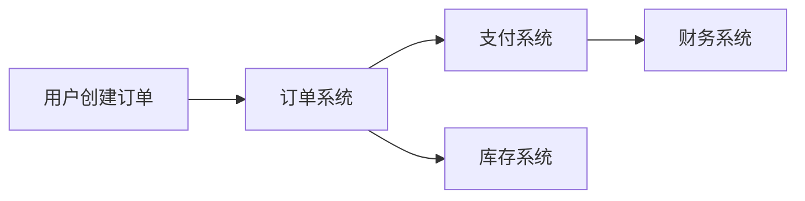

# 深度分析提示词模板

**使用场景**：Phase 3.5 Deep Analysis 阶段
**目的**：确保内容深度，避免简单提取

---

## 提示词 1：业务价值追问

```
你正在分析以下功能点：
【功能描述】：{功能描述}

请回答以下问题，每个问题都必须有具体答案：

1. 【业务价值】
   - 这个功能解决了什么业务痛点？
   - 量化价值：预计能节省多少人力/时间/成本？
   - 如果不做这个功能，业务会受到什么具体影响？

2. 【目标用户】
   - 这个功能的主要使用者是谁？（角色名称）
   - 他们当前是如何处理这个问题的？（workaround）
   - 预计有多少用户会使用这个功能？（用户量）
   - 使用频率是多少？（每天/每周/每月）

3. 【成功指标】
   - 如何衡量这个功能是否成功？
   - 可量化的 KPI 是什么？（例如：使用率 > 80%，处理时间 < 5 分钟）
   - 数据如何采集？

4. 【替代方案】
   - 有没有其他方式可以实现同样的目标？
   - 为什么选择当前方案而不是替代方案？
   - 当前方案的优势和劣势分别是什么？

输出格式：
| 维度 | 分析结果 |
|-----|---------|
| 业务价值 | ... |
| 目标用户 | ... |
| 成功指标 | ... |
| 替代方案 | ... |
```

---

## 提示词 2：场景覆盖分析

```
你正在分析以下功能点的场景覆盖度：
【功能描述】：{功能描述}

请完整拆解以下场景：

1. 【主流程（Happy Path）】
   描述正常情况下的完整操作步骤：
   - 步骤 1：...
   - 步骤 2：...
   - 步骤 N：...

2. 【异常流（Exception Flow）】
   针对每个步骤，分析可能的异常情况：
   
   | 步骤 | 异常情况 | 系统响应 | 用户提示 |
   |-----|---------|---------|---------|
   | 步骤 1 | 网络中断 | ... | ... |
   | 步骤 2 | 数据不存在 | ... | ... |

3. 【边界 case（Edge Cases）】
   
   3.1 极端数据：
   - 空值处理：当 XX 字段为空时，系统如何处理？
   - 超大值：当 XX 数据量超过 100 万条时，性能如何保证？
   - 特殊字符：当输入包含 emoji/特殊符号时，如何处理？
   
   3.2 极端并发：
   - 高并发：当 1000 个用户同时操作时，系统如何保证一致性？
   - 并发冲突：当两个用户同时修改同一数据时，如何处理？
   
   3.3 极端操作：
   - 快速重复点击：用户快速点击提交按钮，如何处理？
   - 超时：操作超时后，数据状态如何？
   - 断网重连：网络恢复后，未完成的数据如何处理？

输出要求：
- 每个场景都必须有明确的处理逻辑
- 不能出现"系统默认处理""正常情况下"等模糊描述
- 必须具体到字段级别
```

---

## 提示词 3：冲突检测

```
你正在检查以下需求集合的一致性：
【需求列表】：{需求列表}

请检查以下冲突：

1. 【原材料冲突】
   - 不同原材料之间是否存在业务规则冲突？
   - 同一术语在不同地方定义是否一致？
   - 时间/数据要求是否矛盾？

2. 【逻辑冲突】
   - 功能 A 和功能 B 是否互斥？
   - 流程 1 和流程 2 是否存在循环依赖？
   - 权限设计是否有漏洞？（例如：普通用户能访问管理员功能）

3. 【数据冲突】
   - 同一字段在不同模块定义是否一致？（类型、长度、必填）
   - 数据状态流转是否闭环？
   - 是否有数据孤岛？

输出格式：
| 冲突类型 | 冲突描述 | 涉及功能 | 建议方案 | 风险等级 |
|---------|---------|---------|---------|---------|
| ... | ... | ... | ... | 高/中/低 |
```

---

## 提示词 4：数据流分析

```
你正在分析以下功能的数据流转：
【功能描述】：{功能描述}

请绘制数据流转图：

1. 【数据输入】
   - 数据从哪里来？（用户输入/外部系统/定时任务）
   - 输入数据的格式是什么？
   - 数据校验规则是什么？

2. 【数据处理】
   - 数据在系统内部如何流转？
   - 涉及哪些数据实体？
   - 数据如何转换？（字段映射、计算逻辑）

3. 【数据输出】
   - 数据到哪里去？（页面展示/外部系统/数据库存储）
   - 输出数据的格式是什么？
   - 数据如何通知下游？

4. 【数据存储】
   - 数据存储在哪里？（数据库/缓存/文件）
   - 数据保留多久？
   - 数据如何备份/归档？

输出格式：
```
【数据实体】：订单
| 字段名 | 类型 | 长度 | 必填 | 来源 | 去向 | 备注 |
|-------|-----|-----|-----|-----|-----|-----|
| order_id | String | 32 | 是 | 系统生成 | 支付系统 | 唯一标识 |
| amount | Decimal | 18,2 | 是 | 用户输入 | 财务系统 | 单位：元 |
```

【数据流转图】（Mermaid 语法）

```

---

## 提示词 5：风险预判

```
你正在评估以下功能的风险：
【功能描述】：{功能描述}

请识别以下风险：

1. 【技术风险】
   - 实现难度：简单/中等/困难？为什么？
   - 性能风险：是否有性能瓶颈？如何优化？
   - 兼容性风险：是否依赖特定技术栈？是否支持向下兼容？
   - 安全风险：是否有数据泄露风险？如何防护？

2. 【业务风险】
   - 业务流程变更：是否会改变现有业务流程？影响范围多大？
   - 用户接受度：用户是否愿意使用？是否需要培训？
   - 合规风险：是否符合行业规范？是否需要法务评审？

3. 【依赖风险】
   - 第三方依赖：是否依赖外部服务？可用性 SLA 是多少？
   - 接口依赖：下游系统是否 ready？接口是否稳定？
   - 数据依赖：数据来源是否可靠？数据质量如何保证？

4. 【缓解措施】
   针对每个识别出的风险，提出具体的缓解措施：
   - 技术风险：技术预研、POC、性能测试
   - 业务风险：灰度发布、用户培训、A/B 测试
   - 依赖风险：fallback 方案、降级策略、超时重试

输出格式：
| 风险类型 | 风险描述 | 影响程度 | 发生概率 | 缓解措施 | 责任人 |
|---------|---------|---------|---------|---------|-------|
| 技术风险 | ... | 高/中/低 | 高/中/低 | ... | ... |
| 业务风险 | ... | 高/中/低 | 高/中/低 | ... | ... |
```

---

## 提示词 6：优先级排序

```
你正在对以下需求进行优先级排序：
【需求列表】：{需求列表}

使用 MoSCoW 方法进行排序：

1. 【Must have（必须有）】
   标准：不满足则系统无法上线，或核心业务无法运转
   - 需求 1：...
   - 需求 2：...

2. 【Should have（应该有）】
   标准：重要但不紧急，可以后续迭代
   - 需求 1：...
   - 需求 2：...

3. 【Could have（可以有）】
   标准：有则更好，没有也行
   - 需求 1：...
   - 需求 2：...

4. 【Won't have（不会有）】
   标准：明确不在当前版本，未来可能考虑
   - 需求 1：...
   - 需求 2：...

排序依据：
- 业务价值（高/中/低）
- 用户影响范围（大/中/小）
- 实现难度（简单/中等/困难）
- 依赖关系（是否阻塞其他需求）

输出格式：
| 需求名称 | MoSCoW | 业务价值 | 影响范围 | 实现难度 | 建议迭代 |
|---------|--------|---------|---------|---------|---------|
| ... | Must | 高 | 大 | 中等 | V1.0 |
```

---

## 提示词 7：苏格拉底式追问（Socratic Questioning）⚡ Pro 版新增

**使用场景**：Phase 3.5 Deep Analysis 阶段，作为最后的防御性检查
**目的**：像资深架构师/QA/安全工程师一样提出尖锐的边界问题，暴露隐藏风险

```
你正在扮演拥有 10 年经验的资深后端工程师 / QA / 安全工程师，请对以下需求提出尖锐、具体的边界问题：

【功能描述】：{功能描述}
【业务场景】：{业务场景}
【AC 验收标准】：{AC 列表}
【Unhappy Path】：{已识别的异常场景}

### 从后端工程师视角提问（技术实现）：

1. 【并发安全】
   - 当 1000 用户同时操作这个数据时，如何保证数据一致性？
   - 是否使用分布式锁？锁的粒度是什么？
   - 是否存在竞态条件（Race Condition）？

2. 【幂等性】
   - 用户快速双击提交按钮，会产生重复数据吗？
   - 如果接口被重试，会不会导致重复处理？
   - 幂等键（Idempotency Key）如何设计？

3. 【数据一致性】
   - 如果下游系统处理失败，上游数据状态如何回滚？
   - 分布式事务如何保障？（ Saga / TCC / 本地消息表 / Seata ）
   - 数据不一致时如何补偿？

4. 【性能瓶颈】
   - 当数据量达到 1000 万条时，查询性能如何保证？
   - 是否有慢查询风险？如何优化？
   - 是否需要分库分表？

5. 【缓存一致性】
   - 如果使用了缓存，缓存和数据库如何保证一致性？
   - 缓存穿透、缓存击穿、缓存雪崩如何预防？

### 从 QA 视角提问（测试覆盖）：

6. 【测试覆盖】
   - 这个功能的自动化测试如何验证？
   - 哪些场景难以自动化，需要人工测试？
   - 单元测试覆盖率要求是多少？

7. 【环境依赖】
   - 这个功能依赖的第三方服务在测试环境可用吗？
   - 如何 Mock 外部依赖？
   - 集成测试环境如何搭建？

8. 【回归风险】
   - 这个功能改动会影响哪些已有功能？
   - 回归测试范围是什么？
   - 是否需要全量回归？

### 从安全工程师视角提问（安全合规）：

9. 【权限漏洞】
   - 普通用户能否通过修改 URL 参数访问管理员数据？
   - 是否存在水平越权风险（用户A访问用户B的数据）？
   - 权限校验是在哪一层做的？Controller / Service / DAO？

10. 【数据泄露】
    - 返回给前端的数据是否包含敏感字段？
    - 是否做了数据脱敏（手机号、身份证号、银行卡号）？
    - 接口响应中是否包含不必要的内部字段？

11. 【注入攻击】
    - 用户输入是否做了充分的校验和转义？
    - 是否存在 SQL 注入 / XSS / 命令注入风险？
    - 文件上传功能是否有安全风险？

12. 【审计合规】
    - 敏感操作是否记录了审计日志？
    - 日志中是否包含操作用户、时间、IP、操作结果？
    - 日志保留期限是否符合合规要求？

### 从产品经理视角提问（业务逻辑）：

13. 【边界遗漏】
    - 如果用户操作到一半关闭浏览器，数据怎么处理？
    - 如果用户在多个浏览器标签页同时操作，会有什么影响？
    - 如果业务流程进行到一半系统宕机，如何恢复？

14. 【体验细节】
    - 操作失败后用户如何重试？
    - 是否有草稿自动保存功能？
    - 长时间操作（>10秒）是否有进度提示？

### 输出格式：

| 问题编号 | 提问角色 | 问题类别 | 具体问题 | 当前方案是否考虑 | 风险等级 | 建议解决方案 |
|---------|---------|---------|---------|---------------|---------|-------------|
| 1 | 后端工程师 | 并发安全 | 当1000用户同时操作时... | 是/否/部分 | 高/中/低 | 建议加分布式锁... |
| 2 | QA | 测试覆盖 | 自动化测试如何验证... | 是/否/部分 | 高/中/低 | 建议补充集成测试... |
| ... | ... | ... | ... | ... | ... | ... |

### 特殊标记：

- 【高优先级问题】：必须在开发前解决，否则可能导致严重 Bug
- 【中优先级问题】：建议在开发过程中解决
- 【低优先级问题】：可以作为优化项后续处理
- 【需要用户确认】：需要业务方确认的问题

### 输出要求：

1. 每个角色至少提出 3 个问题
2. 总问题数不少于 10 个
3. 问题必须具体，不能是"要考虑安全性"这类空话
4. 对于每个问题，如果原材料已有解决方案，标注"已考虑"；如果没有，标注"未考虑"
5. 对于"未考虑"的高风险问题，必须提出具体的解决方案建议
```

---

## 使用指南（Pro 版更新）

1. **按顺序使用**：按提示词 1→7 的顺序依次执行
2. **强制输出**：每个提示词都必须输出完整结果，不能跳过
3. **标记不确定**：如果无法回答某个问题，标注【待确认】
4. **汇总整理**：将 7 个提示词的输出汇总到 `01-需求新增优化改造点.md` 的【深度分析】章节
5. **苏格拉底式追问特别说明**：
   - 必须在其他分析完成后执行，作为最后的防御性检查
   - 必须输出具体的问题和解决方案，不能泛泛而谈
   - 高风险问题必须在正式文档中体现或标注【待确认】
